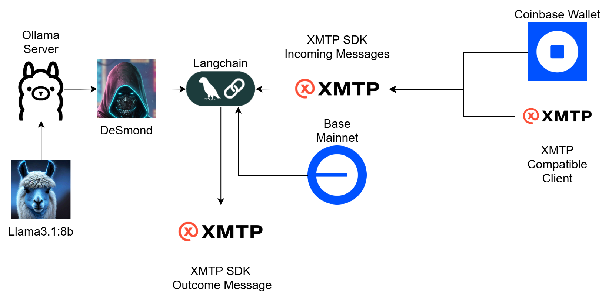

# 🤖 DeSmond: the onchain agent for group payments, wallets & physical commerce — right inside your Coinbase wallet chats, powered by XMTP and Base.

 

- DeSmond Address: **0xC69449f60De274Ca80B6d115019436788Df274dF**
- DeSmond Basename: **desmond-ai.base.eth**


## Fast Links:

- [Video](https://www.youtube.com/watch?v=32IJoXUx5Cg)
- [Presentation](https://docs.google.com/presentation/d/1LHxcHGFITy-jj_aXwFaUOZb6wuLQ54nCRZL9rdt8hyQ/edit?usp=sharing)
- [XMTP.chat](https://xmtp.chat/)

## Proof of transactions:

- Basename Setup: https://basescan.org/name-lookup-search?id=desmond-ai.base.eth
- Chat Transactions: 
  - https://basescan.org/tx/0xa16f0a631264470dbd9d4ac1aa275bf120d32bdad7a19a29aa8a996a7ecf6a60
  - https://basescan.org/tx/0x0a06ed0bb9751df7756811772b3f6f6c90f918464a8888e4017361b8bdddd031
  - https://basescan.org/tx/0xb331ac6262c02b6f63a127e98130a793e80243e3ef64d905e46c99017afa5351

## 🖼️ System Diagram:



## ✨ Features:

* **On-Chain Transactions:** Generates native ETH and USDC transactions directly on Base Mainnet. 

* **Split Payments:** Splits USDC payments between group members in XMTP chats.
  
* **Query Balances:** Check your Native Token and USDC balances in real time.
  
* **Basenames Integration:** Integrate Base ENS Domains aka Basenames (`.base.eth`) for seamless transactions.
  
* **AI LLM Queries:** Ask the assistant general queries; it leverages web and local tools to provide precise answers.

---

## **XMTP (Extensible Message Transport Protocol)**

**XMTP** is an open protocol and network for secure, private messaging between blockchain addresses. It's designed to be decentralized and interoperable across various blockchain environments.

DeSmond uses the `@xmtp/node-sdk` to listen for incoming messages, manage conversations (both Direct Messages and Group Chats), and send transaction requests back to users.

* **XMTP Signer**:

In the case of our agent, it is an SCW, which allows us to improve its security and control.

```javascript

const signer = {
  type: "SCW",
  getIdentifier: () => ({
    identifierKind: IdentifierKind.Ethereum,
    identifier: "0xc69449f60de274ca80b6d115019436788df274df",
  }),
  signMessage: async (message) => {
    // Custom Wallet Signature
    const signature = await getSignature("xxxxxxx", message);
    return toBytes(signature);
  },
  getChainId: () => {
    return 8453n;
  },
};
```

* **XMTP Client:**

For our agent client, we use the production version since the agent is available to talk to and execute transactions on Mainnet.

```javascript
const client = await Client.create(signer, {
    dbPath: null,
    env: "production",
    codecs: [new WalletSendCallsCodec(), new TransactionReferenceCodec()],
});
```
* **XMTP Callbacks:**:

Callbacks for incoming messages are used to obtain the context of the conversation, as well as to obtain essential data for on-chain tools to function correctly. These include group members, which address invoked the message, etc.

```javascript
// On Message DM
const onMessageDM = async (conversation, event) => {
    await conversation.send("Processing...");
    console.log({ event, kind: "DM" });
    const agentAddress = signer.getIdentifier().identifier.toLowerCase();
    let members = await conversation.members();
    const fromAddress = members.filter(
    (m) => m.inboxId === event.senderInboxId
    )[0].accountIdentifiers[0].identifier;
    const context = { origin: "DM", agentAddress, fromAddress, conversation };
    const input = setInput(event.content);
    const output = await graph_dm.invoke(input, config(context));
    conversation.send(output.messages[output.messages.length - 1].content);
};

// On Message Group
const onMessageGroup = async (conversation, event) => {
    await conversation.send("Processing...");
    console.log({ event, kind: "Group" });
    const agentAddress = signer.getIdentifier().identifier.toLowerCase();
    let members = await conversation.members();
    const fromAddress = members.filter(
        (m) => m.inboxId === event.senderInboxId
    )[0].accountIdentifiers[0].identifier;
    members = members.filter(
        (m) => m.accountIdentifiers[0].identifier !== agentAddress
    );
    members = members.map((m) => m.accountIdentifiers[0].identifier);
    const context = {
        origin: "Group",
        members,
        agentAddress,
        fromAddress,
        conversation,
    };
    const input = setInput(event.content.replace("@DeSmond", ""));
    const output = await graph_group.invoke(input, config(context));
    conversation.send(output.messages[output.messages.length - 1].content);
};
```

### All agent code is here:

* [Agent Code](./Agent/index.js)

## **Basenames (`.base.eth`)**

**Basenames** are human-readable domain names (like `alice.base.eth`) that resolve to blockchain addresses on the Base network, similar to how ENS (Ethereum Name Service) works on Ethereum Mainnet. They significantly improve the user experience by replacing complex hexadecimal addresses with memorable names.

DeSmond integrates Basenames by:

* **Basename to Address Resolver:** When a user provides a `.base.eth` name (e.g., `satoshi.base.eth`) as a recipient for a transaction, DeSmond uses the `EnsResolver` (adapted for Base) to convert it into the corresponding blockchain address.

```javascript
async function getAddress(basename) {
  try {
    const ensResolver = await EnsResolver.fromName(ethProvider, basename);
    if (!ensResolver) {
      return "";
    } else {
      const address = await ensResolver.getAddress();
      return address;
    }
  } catch (e) {
    return "";
  }
}
```

* **Addresses to Basename Reverse Resolver :** For displaying sender or group member addresses, DeSmond attempts to reverse-resolve the blockchain address back into its `.base.eth` name using a custom `basenamesABI` contract interaction. This ensures that users see familiar names instead of raw addresses, enhancing readability and trust.

```javascript
const convertChainIdToCoinType = (chainId) => {
    // L1 resolvers to addr
    if (chainId === mainnet.id) {
        return "addr";
    }
    const cointype = (0x80000000 | chainId) >>> 0;
    return cointype.toString(16).toLocaleUpperCase();
};

const convertReverseNodeToBytes = (address, chainId) => {
    const addressFormatted = address.toLocaleLowerCase();
    const addressNode = keccak256(addressFormatted.substring(2));
    const chainCoinType = convertChainIdToCoinType(chainId);
    const baseReverseNode = namehash(
        `${chainCoinType.toLocaleUpperCase()}.reverse`
    );
    const addressReverseNode = keccak256(
        encodePacked(["bytes32", "bytes32"], [baseReverseNode, addressNode])
    );
    return addressReverseNode;
};

async function getBasename(address) {
    try {
        const addressReverseNode = convertReverseNodeToBytes(address, base.id);
        const name = await contractBaseNames.name(addressReverseNode);
        return name === "" ? address : name;
    } catch (e) {
        return address;
    }
}
```

### All agent code is here:

* [Agent Code](./Agent/index.js)
* [Basenames Contract](./Agent/contracts/basenames.js)

## 🛠️ Agent Tools:

DeSmond comes with a suite of specialized tools that allow it to interact with the blockchain and internet.

### **Wallet Operations**

* `transfer_native`: Initiates ETH transfers on Base Mainnet.

* `transfer_usdc`: Initiates USDC transfers on Base Mainnet.

* `split_payment`: Divides and sends USDC to multiple recipients in a group chat.

* `get_balance`: Retrieves the user's ETH balance on Base Mainnet.

* `get_balance_usdc`: Retrieves the user's USDC balance on Base Mainnet.

* `get_balances`: Retrieves ETH balances for all members in a group chat.

* `get_balances_usdc`: Retrieves USDC balances for all members in a group chat.

### **Information Retrieval**

* `web_search`: Performs internet searches using DuckDuckGo to answer general queries or find up-to-date information.

### **Fallback**

* `fallback`: A general-purpose tool activated when no other tool is directly applicable, prompting the agent to offer friendly interaction.

### All agent code is here:

* [Agent Code](./Agent/index.js)
* [Contracts](./Agent/contracts)

## 🤝 Usage

Once deployed and running, our agent DeSmond will listen for messages on the XMTP network.

* **Direct Messages (DMs):** Simply send a message to DeSmond's address. You can check balances, initiate transfers, or make inquiries.

    * "What's my ETH balance?"

    * "Send 0.05 ETH to altagahacker.base.eth"

    * "How much USDC do I have?"

    * "Search for the latest news on crypto regulations."

* **Group Chats:** In a group chat, you'll need Desmond's address added to the group, and to call an action, you'll need to add '@DeSmond' to the message so the agent can process it, just like you call '@meta' in WhatsApp. This prevents the agent from having to react to every message in a group.
  
    * "@DeSmond, split the payment, 1 USDC to desposbased.base.eth"
    * "@DeSmond, what are everyone's ETH balances?"

### All agent code is here:

* [Agent Code](./Agent/index.js)

## 💡 Future Improvements

* **Multi-chain Support:** Extend transaction capabilities beyond Base Mainnet to other EVM chains.

* **More Transaction Types:** Add support for other DeFi actions like swapping, staking, or liquidity provision.

* **Advanced Basenames Features:** Integrate more deeply with Basenames for richer profile information.

* **Group and DM context:** Allow the agent to access the entire chat context to respond to queries or actions.
